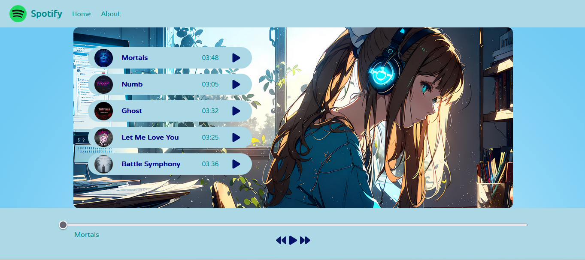

# spotify_clone

# 🎵 Spotify Clone Web App

A simple yet functional **Spotify-inspired music player** built using **HTML, CSS, and JavaScript**. This project replicates key features of a basic audio player including playback controls and UI design.

## 🔧 Features

- 🎧 **5-song playlist** with song titles, artist names, and album artwork
- ▶️ **Play**, ⏸️ **Pause**, ⏭️ **Next**, and ⏮️ **Previous** button functionality
- 🎛️ **Interactive bottom navigation bar** for easy music control
- 💡 Responsive and intuitive UI using custom **CSS**
- ⚙️ JavaScript-based **audio control logic** and dynamic DOM updates

## 🖼️ Preview




## 🚀 Getting Started

Clone the repository and open `index.html` in your browser:

```bash
git clone https://github.com/Ghara9021/spotify-clone.git
cd spotify-clone
